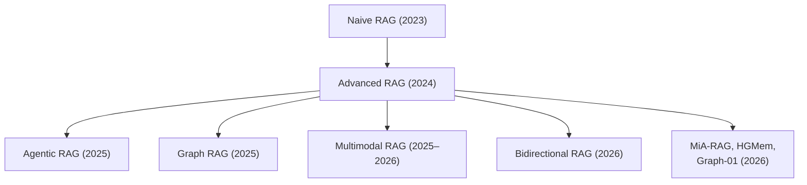

What’s Next for RAG
- Streaming RAG — retrieval from live data streams (Kafka → vector index → LLM)
- Federated RAG — retrieval across org boundaries with access control
- Self-healing RAG — automatic pipeline and chunking adjustments
- Multilingual RAG — cross-lingual retrieval with language-agnostic embeddings

|  Paper |   Year |
| ---     | ----    |
|[Classifying and Addressing the Diversity of Errors in Retrieval-Augmented Generation Systems](https://arxiv.org/html/2510.13975v1)|15 Oct 2025|