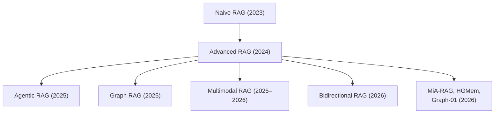

```mermaid
flowchart TD
    A["Naive RAG (2023)"] --> B["Advanced RAG (2024)"]

    B --> C["Agentic RAG (2025)"]
    B --> D["Graph RAG (2025)"]
    B --> E["Multimodal RAG (2025–2026)"]
    B --> F["Bidirectional RAG (2026)"]
    B --> G["MiA-RAG, HGMem,<br/>Graph-01 (2026)"]
```

What’s Next for RAG
- Streaming RAG — retrieval from live data streams (Kafka → vector index → LLM)
- Federated RAG — retrieval across org boundaries with access control
- Self-healing RAG — automatic pipeline and chunking adjustments
- Multilingual RAG — cross-lingual retrieval with language-agnostic embeddings

|  Paper |   Year |
| ---     | ----    |
|[Trustworthy RAG: An Evaluation Agent for Detecting Misinformation and Knowledge Poisoning in Generative AI Systems](https://arxiv.org/html/2608.21095)|21 Aug 2026|
|[GFM-RAG: Graph Foundation Model for Retrieval Augmented Generation](https://arxiv.org/abs/2502.01113)|11 Dec 2025|
|[Classifying and Addressing the Diversity of Errors in Retrieval-Augmented Generation Systems](https://arxiv.org/html/2510.13975v1)|15 Oct 2025|
|[ARES: An Automated Evaluation Framework for Retrieval-Augmented Generation Systems](https://arxiv.org/abs/2311.09476)|2024-03-31|
| [Retrieval-Augmented Generation for Large Language Models: A Survey](https://arxiv.org/html/2312.10997v5) |2024-03-27|
